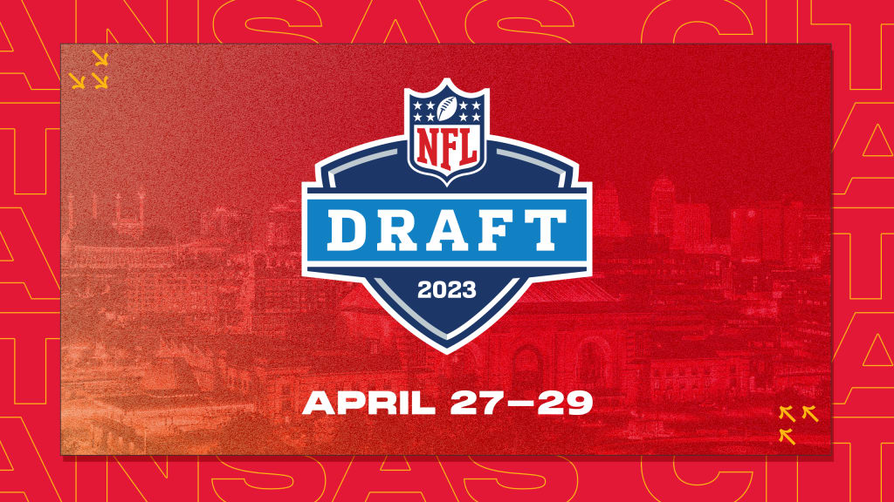
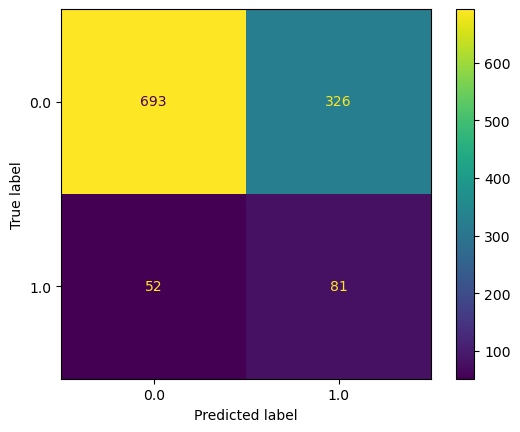
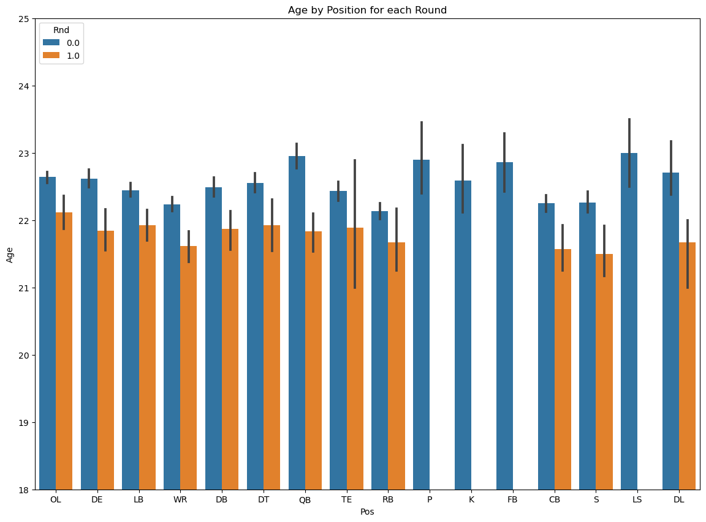
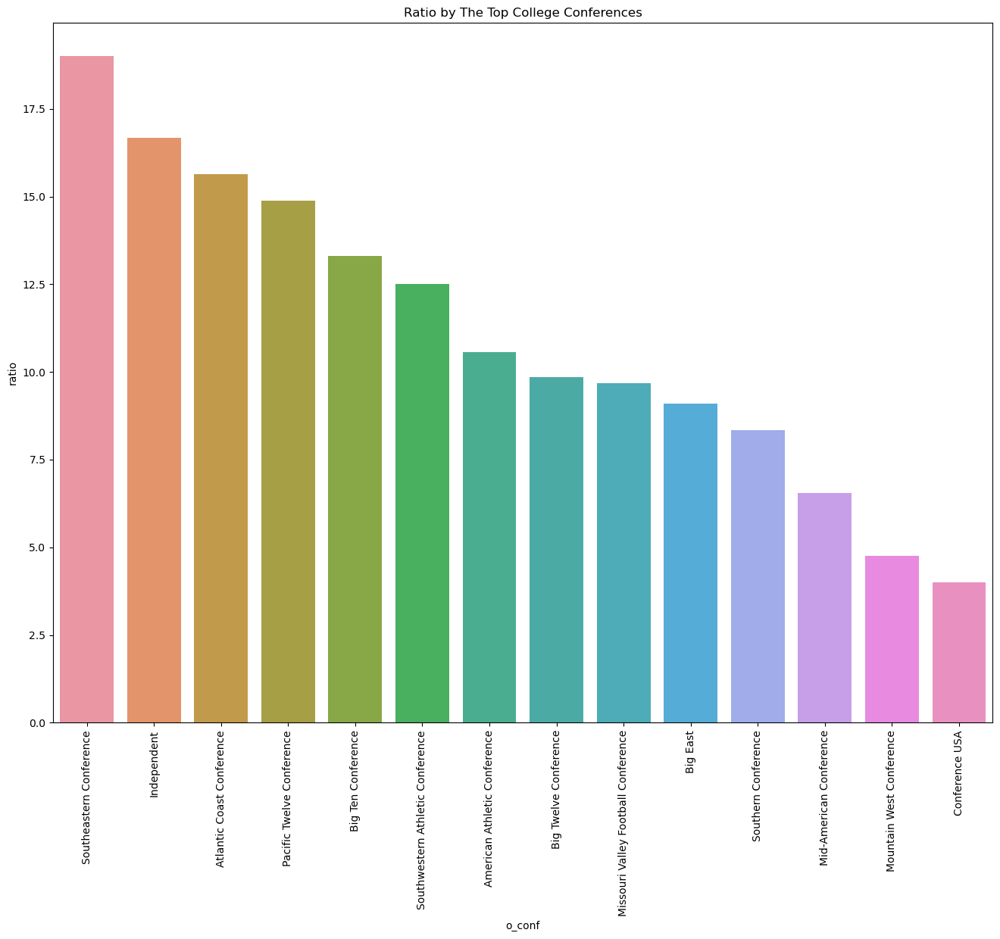
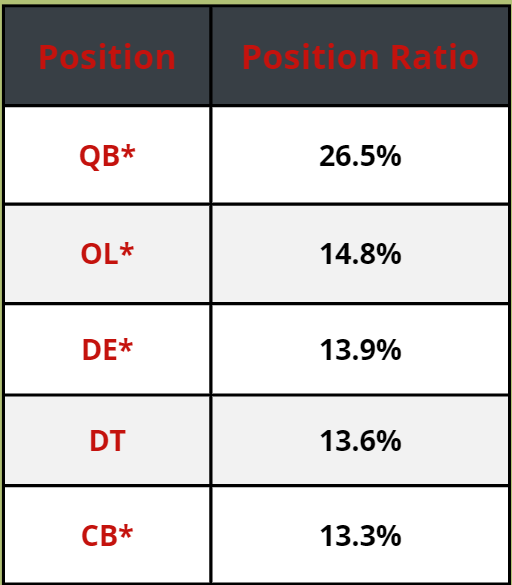

# NFL Draft Classification

# **Author**: Josh Palgon

## Overview

My New York Jets are looking to gain additional insight into the most important area to improve their team...the NFL Draft. I am going to help Joe Douglas and the Jets front office better understand what types of players get drafted in the first and which ones do not.

My data was web scraped from sports-reference.com and merged with the NFL_data Python package. The scraping took some time but once I found out the sites web scraping rules, I was able to set a sleep timer and properly run it all.

Premium positions were extremely important for determining whether a player was drafted in round 1. 4 of the top 5 position ratios of players drafted in the first round were premium positions. Additionally, college conference had a similar effect all of the top 5 college conference ratios come from a power 5 conference.

Every single position had a lower age for round 1 players than non round 1 players. 

## Business Problem

The Jets are trying to break the NFL's longest playoff drought. With the NFL Draft being the best way to improve the team, they are looking to understand which type of players get drafted in the first round and which ones do not.

Understanding which players get drafted in the first round or not has several applications but the primary application would be when choosing between several players in the first round. If the front office is having a hard time deciding between multiple players (which happens often) they can select the player who was predicted to be a first round pick versus any players who weren't in hopes they could select that player later in the draft.

## Data

The majority of my data was web scraped from sports-reference.com. This was my first time web scraping which was somewhat problematic for completing this project. There were two prongs to scraping the data from sports-reference. The first prong of getting the list of players for each draft from 2013-2022 was actually done by Savvas Tjortjoglou. Almost all of his worked perfectly but I made a few adjustments to make it run properly and for my time period. Here is the link of his work http://savvastjortjoglou.com/nfl-draft.html. There were a few very important data points I got from the first prong but the bulk of the data and my time lied in the second prong. 

The second prong consisted of scraping each players college stats page with the  link that I got in part of the first prong. Most of my issues came from this prong mainly due to hard to scrape tags that were not the players' primary stat category. For example QBs passing data was fairly easily scrapable but their rushing stats table while tagged the same way did not come that easy. In the end I was not able to get any secondary or beyond category. Once I figured out how to scrape the primary categories for each player I kept running into 429 HTTP Error requests. Right before I was about to give up on this data, I remembered coming across sports-reference's site on their data usage. They actually had a page that gave an explicit description of what they block. It turns out I just needed to run a sleep time of greater than 3 seconds for that error to no longer occur. They do update their page so I proved the link here https://www.sports-reference.com/bot-traffic.html.

Additionally, I supplemented the sportsreference data with the NFL_data Python package for a few extra features.

## Modeling

For my modeling I separated my numeric columns from my categorical columns. On my categorical columns, I OneHotEncoded them. On my numerical columns, I used a simple imputer to handle the NaNs and impute 0 as any NaN should be 0 anyway based on how I scraped my data. Additionally, I used a MinMaxScaler on the numerical data. I chose a MinMaxScaler because I had a very imbalanced dataset and MinMaxScaler works better on imbalanced data than a StandardScaler.

Late in the game I tried combinations of SMOTE, RandomOverSampler and RandomUnderSampler with different strategy weights. The use of RandomUnderSampler created an increase in recall but at the cost of accuracy. I will continue to tune these parameters for all models in attempt to get some better results. For my final model oversampling with a strategy ratio of 1 was my best to balance the data.

Next I created my grid with each parameter for the given model along with the sampling technique. 

Finally I threw my grid into a gridsearch with the combined transformations, the model type itself and a Cross Validation of 5. I chose recall as my metric to maximize as I did not want to misclassify a players who was drafted in round 1 as a non first round player.

In total I ran 6 different models:
- Logistic Regression
- Gaussian NB
- Decision Tree
- Random Forest
- KNN
- XGBoost

### Logistic Regression Matrix

## Evaluation

### Age by Position for each Round

For each position the age of the round 1 players is significantly lower than the non round 1 players.

### College Conferences

The power 5 conferences have all of the highest ratios of players drafted in round 1.

### Position Ratio

Premium positions have the highest ratios of players drafted in round 1.

## Conclusions

Premium positions, top conferences, and age are the biggest driving factors which isn't surprising.

While age is significant in predicting round 1 players, it complicates some numerical data w

Rate stats better than cumulative stats mainly due to the fact that many of the best players declare their junior year and don't play in their would be senior season.

## Next steps:

Get more numerical data
- Final season
- Advanced stats
- Non Primary Stats
- More bio information

Add scouting report information and other non numeric data

Build in extra time to web scrape. 

## For More Information

Please look at my full analysis in [my Jupyter Notebooks](https://github.com/jpalgon/Draft_Classification) or my [presentation](./Draft_Classification.pdf).

For any additional questions, please contact:

<ul>
    <li>Josh Palgon (jopalgon@gmail.com)</li>
</ul>
